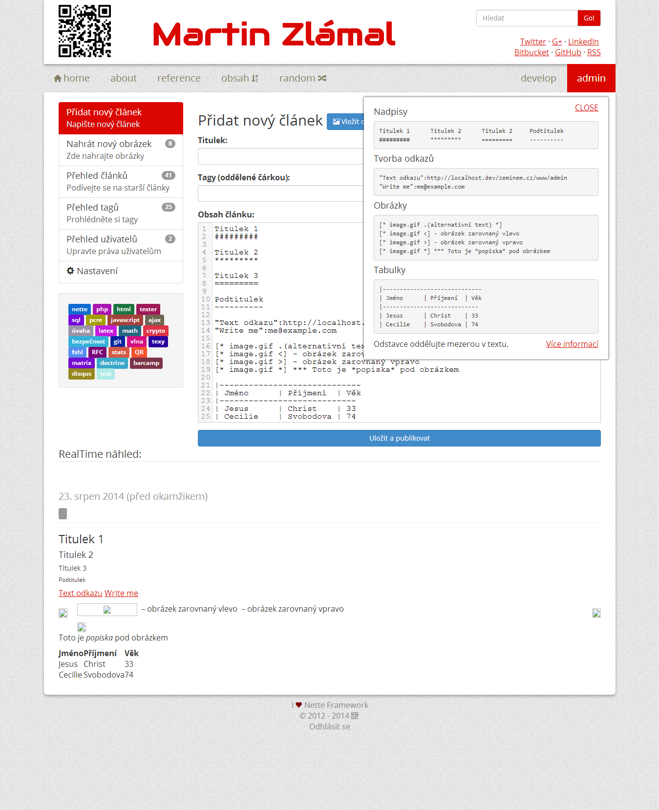
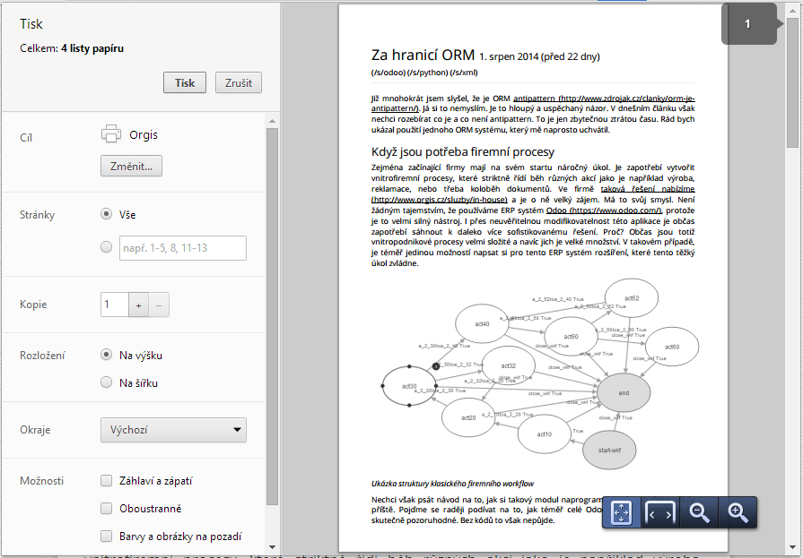
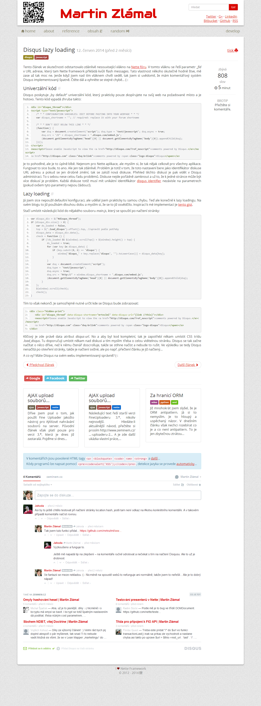

Source code of www.zeminem.cz [1.1]
====================================

Master branch  and Develop branch 

It's tested against at least PHP 5.4.29. The lower version of PHP is not supported, sorry.

What's on the background
------------------------
- [Nette Framework](http://nette.org/en/) - a popular tool for PHP web development
- [Nette Tester](http://tester.nette.org/en/) – enjoyable unit testing
- [Latte](http://latte.nette.org/en/) - amazing template engine for PHP
- [Texy](http://texy.info/en/) - is sexy
- [FSHL](http://fshl.kukulich.cz/) - free, open source, universal and very fast syntax highlighter
- [Webloader](https://github.com/janmarek/WebLoader) - component for smart CSS and JS files loading
- [Doctrine 2](http://www.doctrine-project.org/) - library primarily focused on database storage and object mapping (using [Kdyby](https://github.com/Kdyby/Doctrine))
- [Kdyby\Events](https://github.com/Kdyby/Events) - robust events system for Nette Framework
- [Kdyby\AOP](https://github.com/Kdyby/Aop) - AOP functionality for Nette Framework
- and much more...

Contribution
------------
Do you want to be on contribution list? You can be! Just send one pull request and help me to improve
this project. I'll place your name and link to this page and into the composer.json file.

Name          | Website
------------- | -------
Martin Zlámal | http://www.zeminem.cz/

Installing
----------
The best way to install this project is to download latest package
from repository using Git and load libraries using Composer:

1. Install Git: (see http://msysgit.github.io/)
2. Install Composer: (see http://getcomposer.org/)
3. Clone project via Git:

		git clone https://mrtnzlml@bitbucket.org/mrtnzlml/www.zeminem.cz.git
		-- OR --
		git clone https://mrtnzlml@bitbucket.org/mrtnzlml/www.zeminem.cz.git <folder_name>

		cd www.zeminem.cz
		-- OR --
		cd <folder_name>

4. Load libraries via Composer:

		composer update --no-dev

5. Alternatively you can use Composer instead of `git clone`:

		composer create-project mrtnzlml/zeminem.cz <folder_name> dev-develop

Make directories `temp`, `log`, `www/webtemp`, `www/chunks` and `www/uploads` writable.
Navigate your browser to the `www` directory and you will see a welcome page.
PHP 5.4 allows you run `php -S localhost:8888 -t www` to start the webserver and
then visit `http://localhost:8888` in your browser.
Port must be set according to the local computer settings.

It is CRITICAL that file `app/config/config.neon` & whole `app`, `log`
and `temp` directory are NOT accessible directly via a web browser! If you
don't protect this directory from direct web access, anybody will be able to see
your sensitive data. See [security warning](http://nette.org/security-warning).

Then you have to create database for this website. You can use Adminer tool in
`http://localhost:8888/adminer` or you can do that manually using command line:

		mysql -u root -e 'create database zeminem;'
        mysql -u root -D zeminem < zeminem.sql
        mysql -u root -D zeminem < diff.sql

Updating
--------
If you're still in project folder, the best way how to update
your project from a remote repository is pull it using Git:

1. Install Git: (see http://msysgit.github.io/) - already done
2. Pull project via Git:

		git pull

Git automatically fetch all changes from a remote repository and then merge them into local project.

That's it.

Amazing administration
-----------------------

Awesome print experience
------------------------

Incredible articles
-------------------
